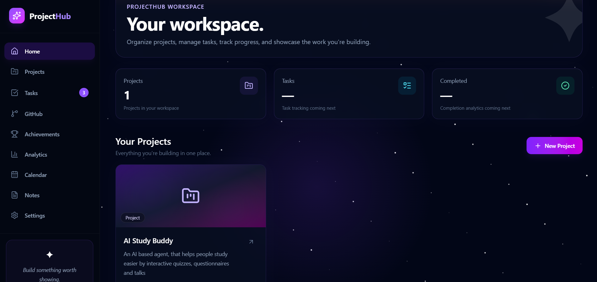

# 🚀 ProjectHub

### A Full-Stack Project Management & Developer Workspace

ProjectHub is a multi-user project management platform that brings projects, tasks, developer activity, analytics, notes, achievements, and planning into one workspace.

It is built as a full-stack application with a Java Spring Boot backend, React frontend, PostgreSQL database, JWT authentication, and GitHub API integration.

---

## ✨ Overview

ProjectHub is designed around a simple idea:

> **Your projects, your tasks, your development activity — all in one place.**

Users can create their own projects, manage tasks, track progress, connect their GitHub profile, view development analytics, maintain notes, record achievements, and organize their work through a calendar.

The application supports multiple users with ownership-based authorization, ensuring that each user only has access to their own projects and associated data.

---

## 🎯 Key Features

### 🔐 Authentication & Security

- User registration
- Secure login
- BCrypt password hashing
- JWT-based authentication
- JWT validation
- Stateless authentication
- Role-based authorization
- USER and ADMIN roles
- Protected REST APIs
- Ownership-based project authorization
- Multi-user support

### 📁 Project Management

- Create projects
- View projects
- View individual project details
- Delete projects
- Project ownership
- Project-specific task management
- PostgreSQL persistence

### ✅ Task Management

- Create tasks
- View tasks
- Update task information
- Delete tasks
- Task descriptions
- Task priorities
- Task statuses
- Task assignment
- Project-based task organization

Supported statuses:

- `TODO`
- `IN_PROGRESS`
- `DONE`

Supported priorities:

- `LOW`
- `MEDIUM`
- `HIGH`

### 🐙 GitHub Integration

ProjectHub integrates with the GitHub REST API to display real developer information.

Users can view:

- GitHub profile
- Profile avatar
- Followers
- Public repositories
- Repository descriptions
- Repository languages
- Stars
- Forks
- Default branches
- Repository links
- Repository update dates

### 📊 Analytics

ProjectHub generates analytics from the user's actual project and task data.

Analytics include:

- Total projects
- Total tasks
- Completed tasks
- Tasks in progress
- Tasks remaining
- Completion percentage
- Priority distribution
- Project workload
- Task distribution by project

### 📅 Calendar

A workspace calendar for organizing:

- Project deadlines
- Meetings
- Important dates
- Personal events
- Time-based reminders

### 📝 Notes

A built-in workspace for storing:

- Technical notes
- Ideas
- Project plans
- Development thoughts
- Interview preparation
- Architecture notes

### 🏆 Achievements

Users can maintain a collection of milestones and accomplishments such as:

- Projects completed
- Coding milestones
- Development achievements
- Learning milestones
- Career accomplishments

### ⚙️ Settings

ProjectHub provides account and workspace settings including:

- User profile information
- Notification preferences
- Interface preferences
- Authentication status
- Logout

---

# 🖥️ Application

## Dashboard

The dashboard provides an overview of the user's ProjectHub workspace and acts as the central entry point to projects, tasks, GitHub activity, analytics, and other workspace features.


---

## Projects

Projects are isolated by user ownership. Each authenticated user sees their own projects rather than projects belonging to other users.

> Add projects screenshot here.

---

## Project Details

Each project has its own workspace containing project information, task statistics, and task management.

> Add project details screenshot here.

---

## Task Management

Tasks are organized according to their current state:

```text
┌──────────────┐
│    TO DO     │
└──────────────┘

┌──────────────┐
│ IN PROGRESS  │
└──────────────┘

┌──────────────┐
│     DONE     │
└──────────────┘


                    ┌─────────────────────┐
                    │      React UI       │
                    │  React + Tailwind   │
                    └──────────┬──────────┘
                               │
                               │ REST API
                               ▼
                    ┌─────────────────────┐
                    │   Spring Boot API   │
                    └──────────┬──────────┘
                               │
                ┌──────────────┼──────────────┐
                │              │              │
                ▼              ▼              ▼
        ┌────────────┐ ┌─────────────┐ ┌──────────────┐
        │ Controller │ │   Security  │ │  Exception   │
        │   Layer    │ │ JWT + Roles │ │   Handling   │
        └─────┬──────┘ └─────────────┘ └──────────────┘
              │
              ▼
        ┌────────────┐
        │  Service   │
        │   Layer    │
        └─────┬──────┘
              │
              ▼
        ┌────────────┐
        │ Repository │
        │   Layer    │
        └─────┬──────┘
              │
              ▼
        ┌────────────┐
        │ Hibernate  │
        │ / JPA      │
        └─────┬──────┘
              │
              ▼
        ┌────────────┐
        │ PostgreSQL │
        └────────────┘
