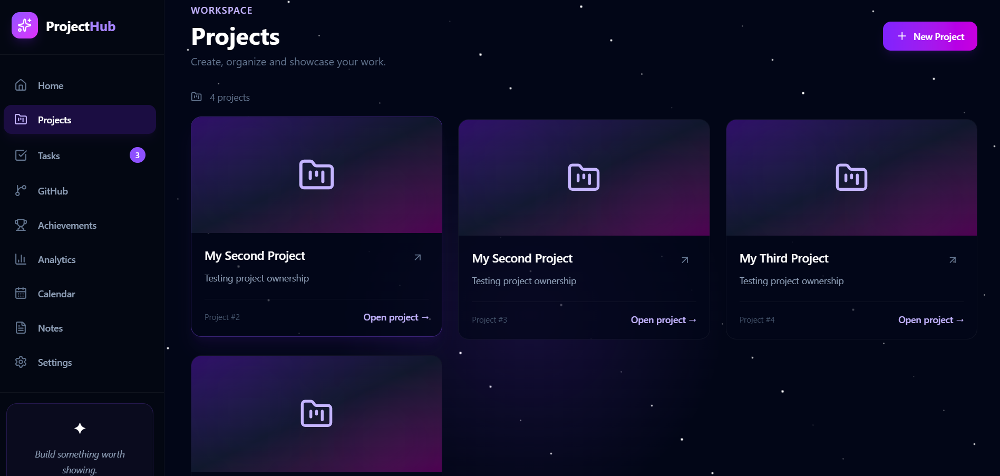
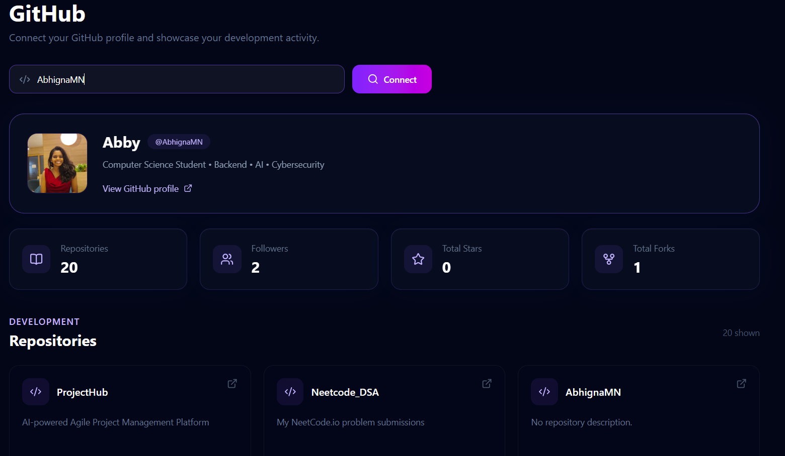
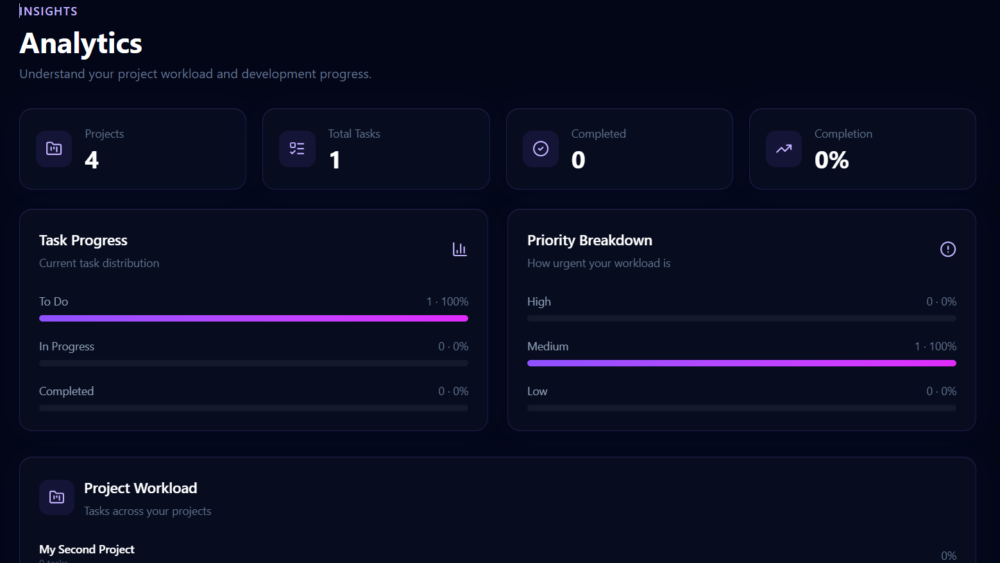
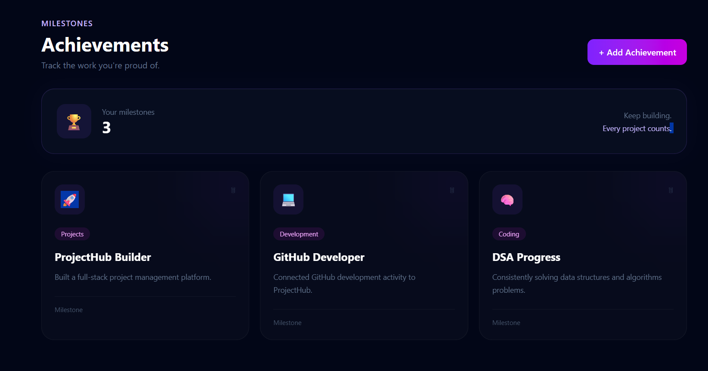

# 🚀 ProjectHub

### Full-Stack Project Management & Developer Workspace


ProjectHub is a multi-user project management platform that brings projects, tasks, developer activity, analytics, notes, achievements, and planning into one workspace.

Built with **Java, Spring Boot, React, PostgreSQL, JWT authentication, and GitHub API integration**, ProjectHub focuses on secure multi-user project management with a modern developer-oriented interface.

---

## ✨ Overview

ProjectHub is designed around a simple idea:

> **Your projects. Your tasks. Your development activity. One workspace.**

Users can create and manage their own projects, organize tasks, track progress, connect their GitHub profile, view project analytics, maintain notes, record achievements, and organize important events.

The application supports multiple users with **ownership-based authorization**, ensuring that users can access only the projects and associated resources they are authorized to access.

---

# 🎯 Features

## 🔐 Authentication & Security

- User registration
- Secure login
- BCrypt password hashing
- JWT-based authentication
- JWT token validation
- Stateless authentication
- Role-based authorization
- `USER` and `ADMIN` roles
- Protected REST APIs
- Ownership-based authorization
- Multi-user support
- Global exception handling
- Duplicate email handling
- Input validation

---

## 📁 Project Management

- Create projects
- View projects
- View project details
- Delete projects
- Project ownership
- User-specific project visibility
- PostgreSQL persistence
- Project-specific task management

### Project Ownership

Each project belongs to its owner.


User A
├── Project A
│   ├── Task 1
│   └── Task 2
│
└── Project B

User B
└── Project C
    └── Task 3

A user cannot simply access another user's projects through the API.



---

## ✅ Task Management

ProjectHub provides task management within projects.

### Task Features

* Create tasks
* View tasks
* Update tasks
* Delete tasks
* Task descriptions
* Task priorities
* Task statuses
* Task assignment
* Project-based task organization

### Task Statuses


TODO
  ↓
IN_PROGRESS
  ↓
DONE


### Task Priorities


HIGH
MEDIUM
LOW


---

## 🐙 GitHub Integration

ProjectHub integrates with the **GitHub REST API** to display real developer activity and repository information.

Users can view:

* GitHub profile
* Profile avatar
* Followers
* Public repositories
* Repository descriptions
* Repository languages
* Stars
* Forks
* Default branches
* Repository links
* Repository update information



---

## 📊 Analytics

ProjectHub provides analytics based on the user's actual project and task data.

Analytics include:

* Total projects
* Total tasks
* Completed tasks
* Tasks in progress
* Tasks remaining
* Completion percentage
* Priority distribution
* Project workload
* Task distribution by project



---

## 📅 Calendar

The Calendar provides a workspace for organizing important dates and events.

Users can add:

* Project deadlines
* Meetings
* Important dates
* Personal events
* Time-based reminders

---

## 📝 Notes

ProjectHub includes a dedicated workspace for storing project-related information.

Notes can be used for:

* Technical notes
* Ideas
* Project plans
* Development thoughts
* Interview preparation
* Architecture notes

---

## 🏆 Achievements

Users can maintain a collection of milestones and accomplishments.

Achievements can represent:

* Completed projects
* Coding milestones
* Development achievements
* Learning milestones
* Career accomplishments



---

## ⚙️ Settings

ProjectHub provides account and workspace preferences including:

* User profile information
* Notification preferences
* Interface preferences
* Authentication status
* Logout

---

# 🖥️ Application Screenshots

## Dashboard

The Dashboard acts as the central workspace for accessing projects, tasks, GitHub activity, analytics, and other ProjectHub features.


---

## Projects

Projects are isolated by user ownership, allowing each authenticated user to manage their own workspace.


---

## GitHub

The GitHub integration displays real repository and profile information.


---

## Analytics

The Analytics page summarizes project and task activity.


---

## Achievements

Users can record and display their development milestones.


---

# 🏗️ Architecture

ProjectHub follows a layered backend architecture.


                    ┌─────────────────────┐
                    │      React UI       │
                    │  React + Tailwind   │
                    └──────────┬──────────┘
                               │
                               │ REST API
                               ▼
                    ┌─────────────────────┐
                    │   Spring Boot API   │
                    └──────────┬──────────┘
                               │
                ┌──────────────┼──────────────┐
                │              │              │
                ▼              ▼              ▼
        ┌────────────┐ ┌─────────────┐ ┌──────────────┐
        │ Controller │ │   Security  │ │  Exception   │
        │   Layer    │ │ JWT + Roles │ │   Handling   │
        └─────┬──────┘ └─────────────┘ └──────────────┘
              │
              ▼
        ┌────────────┐
        │  Service   │
        │   Layer    │
        └─────┬──────┘
              │
              ▼
        ┌────────────┐
        │ Repository │
        │   Layer    │
        └─────┬──────┘
              │
              ▼
        ┌────────────┐
        │ Hibernate  │
        │    / JPA   │
        └─────┬──────┘
              │
              ▼
        ┌────────────┐
        │ PostgreSQL │
        └────────────┘


---

# 🔐 Authentication Flow

ProjectHub uses JWT-based stateless authentication.

```text
User
 │
 ▼
Registration / Login
 │
 ▼
Spring Security
 │
 ▼
Credential Validation
 │
 ▼
JWT Generation
 │
 ▼
Frontend Stores Token
 │
 ▼
Authorization Header
 │
 ▼
JwtAuthenticationFilter
 │
 ▼
JWT Validation
 │
 ▼
Authenticated Request
```

Protected API requests use:

```http
Authorization: Bearer <JWT>
```

---

# 👥 Multi-User Authorization

ProjectHub is designed to support multiple independent users.

The backend performs authorization checks using the authenticated user's identity rather than relying only on frontend filtering.

For example:

```text
User A
 ├── Project 1
 └── Project 2

User B
 ├── Project 3
 └── Project 4
```

User B should not be able to retrieve User A's projects simply by changing a project ID in an API request.

This ownership model is enforced at the backend service layer.

---

# 🧩 Backend Structure

The backend follows a layered architecture:

```text
Controller
    ↓
Service
    ↓
Repository
    ↓
JPA / Hibernate
    ↓
PostgreSQL
```

### Main backend responsibilities

**Controllers**

Handle HTTP requests and expose REST endpoints.

**Services**

Contain application and business logic.

**Repositories**

Handle database access through Spring Data JPA.

**Entities**

Represent persistent database models.

**DTOs**

Control request and response data.

**Security**

Handles JWT authentication and role-based authorization.

**Exception Handling**

Provides centralized API error handling through `@RestControllerAdvice`.

---

# 🛠️ Tech Stack

## Frontend

* React
* React Router
* Tailwind CSS
* Axios
* Lucide React
* Recharts
* Vite

## Backend

* Java
* Spring Boot
* Spring Security
* Spring Data JPA
* Hibernate
* REST APIs

## Database

* PostgreSQL
* Docker

## Authentication

* JWT
* BCrypt

## External Integration

* GitHub REST API

## Development Tools

* IntelliJ IDEA
* Postman
* Git
* GitHub
* VS Code

---

# 📂 Project Structure

```text
ProjectHub/
│
├── backend/
│   └── src/
│       └── main/
│           ├── java/
│           │   └── com/abby/projecthub/
│           │       ├── config/
│           │       ├── controller/
│           │       ├── dto/
│           │       ├── entity/
│           │       ├── exception/
│           │       ├── repository/
│           │       ├── security/
│           │       └── service/
│           │
│           └── resources/
│
├── frontend/
│   ├── src/
│   │   ├── components/
│   │   ├── pages/
│   │   ├── App.jsx
│   │   └── index.css
│   │
│   └── package.json
│
├── screenshots/
│   ├── achievements.png
│   ├── analytics.png
│   ├── dashboard.png
│   ├── githubpage.png
│   └── project.png
│
└── README.md
```

---

# 🔌 API Overview

## Authentication

```http
POST /api/auth/register
POST /api/auth/login
```

## Projects

```http
GET    /api/projects
POST   /api/projects
GET    /api/projects/{id}
PUT    /api/projects/{id}
DELETE /api/projects/{id}
```

## Tasks

```http
GET    /api/projects/{projectId}/tasks
POST   /api/projects/{projectId}/tasks

GET    /api/tasks/{taskId}
PUT    /api/tasks/{taskId}
DELETE /api/tasks/{taskId}
```

Protected endpoints require a valid JWT.

---

# 🗄️ Database Model

The core application relationships can be represented as:

```text
              ┌──────────────┐
              │     User     │
              └──────┬───────┘
                     │
                     │ owns
                     ▼
              ┌──────────────┐
              │   Project    │
              └──────┬───────┘
                     │
                     │ contains
                     ▼
              ┌──────────────┐
              │     Task     │
              └──────┬───────┘
                     │
                     │ assigned to
                     ▼
              ┌──────────────┐
              │     User     │
              └──────────────┘
```

PostgreSQL stores the persistent application data while Hibernate/JPA handles object-relational mapping.

---

# 🔄 Example Application Flow

A typical ProjectHub workflow looks like:

```text
Register
   ↓
Login
   ↓
JWT Authentication
   ↓
Dashboard
   ↓
Create Project
   ↓
Create Tasks
   ↓
Assign Tasks
   ↓
Track Progress
   ↓
View Analytics
   ↓
Connect GitHub
   ↓
Track Development Activity
```

---

# 🚀 Running Locally

## Prerequisites

Make sure the following are installed:

* Java
* Node.js
* PostgreSQL
* Docker
* Git

---

## 1. Clone the repository

```bash
git clone https://github.com/AbhignaMN/ProjectHub.git
```

```bash
cd ProjectHub
```

---

## 2. Start PostgreSQL

Configure PostgreSQL according to the backend application's database configuration.

Docker can also be used to run PostgreSQL locally.

---

## 3. Start the Spring Boot backend

Navigate to the backend directory:

```bash
cd backend
```

Start the Spring Boot application using IntelliJ IDEA or the project's configured build system.

The backend runs on:

```text
http://localhost:8080
```

---

## 4. Start the React frontend

Open a terminal in the frontend directory:

```bash
cd frontend
```

Install dependencies:

```bash
npm install
```

Start the development server:

```bash
npm run dev
```

The frontend normally runs on:

```text
http://localhost:5173
```

---

# 🔒 Production Considerations

Before production deployment, the following should be configured securely:

* JWT secrets through environment variables
* Database credentials through environment variables
* Production CORS configuration
* HTTPS
* Production API URLs
* Secure frontend environment variables
* Production database configuration
* Removal of development-only configuration

**Never commit production secrets, passwords, or JWT signing keys to GitHub.**

---

# 📈 Future Improvements

Potential future enhancements include:

* GitHub OAuth
* Private repository integration
* Team invitations
* Project collaboration
* Comments
* Real-time collaboration
* Kanban drag-and-drop
* AI-assisted project planning
* AI task generation
* Automated testing
* CI/CD pipelines
* Cloud deployment
* Redis caching
* Real-time notifications
* Production monitoring

---

# 🎓 Engineering Concepts Demonstrated

ProjectHub demonstrates practical implementation of:

* Full-stack application development
* REST API design
* Layered backend architecture
* Spring Boot
* Spring Security
* JWT authentication
* BCrypt password hashing
* Role-based authorization
* Ownership-based authorization
* Multi-user systems
* JPA/Hibernate
* PostgreSQL
* Database relationships
* DTO-based API design
* Global exception handling
* React application development
* React Router
* REST API consumption
* GitHub API integration
* Responsive UI development
* Git/GitHub workflow

---

# 👩‍💻 Author

**Abhigna M N**

Computer Science & Engineering Student

Interested in:

* Software Engineering
* Backend Development
* Cybersecurity
* Developer Tools
* Distributed Systems

---

# ⭐ ProjectHub

> **Build it. Track it. Ship it.**

````

### Then save it

In PowerShell:

```bash
git add README.md
git commit -m "Improve ProjectHub README"
git push
````


